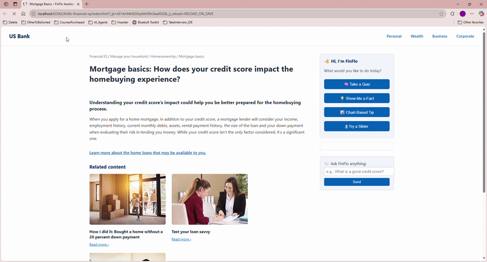

# 🧠 FinFlo Project Documentation

Welcome to the documentation hub for **FinFlo** — a contextual insight assistant designed to enhance static financial education pages.

---

## 🧩 Challenge Submission

This project was submitted for the **US Bancorp BRE Plugin Challenge 2025**.

FinFlo is a plugin-style, context-aware assistant that enhances business rule–driven content with:
- Real-time user interaction
- Micro-learning moments
- Dynamic decision support

It's designed to drop into environments like **U.S. Bank Financial IQ**, modernizing the experience without disrupting existing platforms.

---

## 👋 Meet FinFlo

> “Hi, I’m FinFlo. What would you like to do today?”

This version now includes a dynamic assistant interface with interactive choices:
- 🧠 Quiz-based learning
- 💡 Bite-sized financial facts
- 📊 Visual chart explanations
- 🎛 Slider simulations for user-driven exploration

FinFlo is embedded directly into the article page — no popups, no overlays — just smart insights that meet users in context.

---

## 🚀 Live Demo

You can explore FinFlo directly at:

🔗 [https://thepalslab.github.io/finflo-financial-iq/](https://thepalslab.github.io/finflo-financial-iq/)

This demo shows FinFlo embedded in a real article layout with interactive modes: Quiz, Fact, Chart, and Slider.

---

## 🎥 Interactive Walkthrough

> FinFlo greets the user, offers multiple learning modes, and shows immediate feedback — all within the article experience.

---

## 📘 [Overview: What is FinFlo](README_Enhanced_Overview.md)

Get an introduction to FinFlo, its purpose, and how it transforms content experiences for platforms like Some Bank’s Financial IQ.

---

## 🛠 [MVP, Tech Stack & Usage Guide](README_Tech_MVP_Guide.md)

Dive into the implementation details of the MVP:
- How it works
- What it’s built with
- How to use it
- What’s included in the repo

---

## ✨ [Behind the Name: FinFlo](README_Behind_The_Name.md)

Explore the thinking behind the name "FinFlo" — and how we wanted to make financial learning feel smoother, smarter, and a little more fun.
